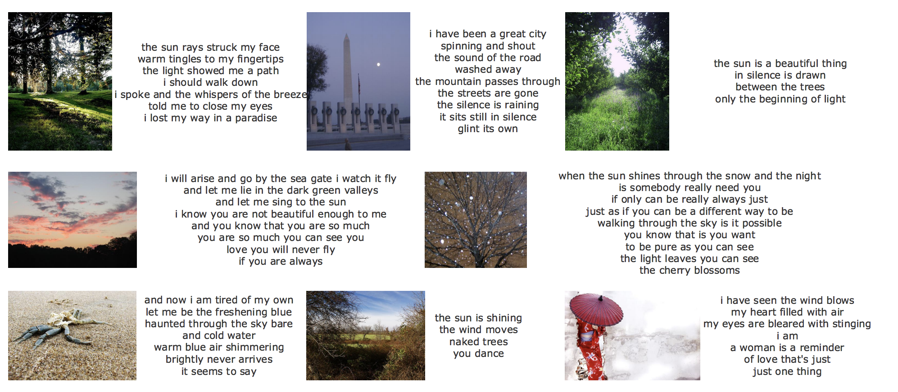
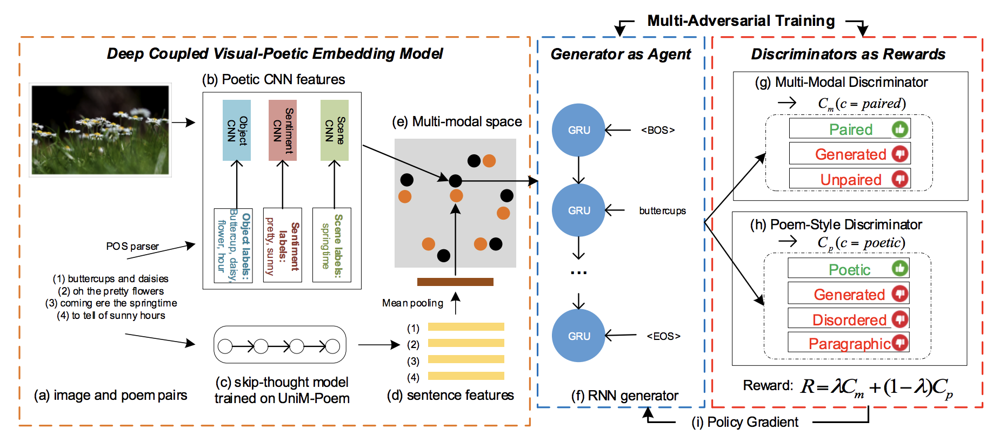
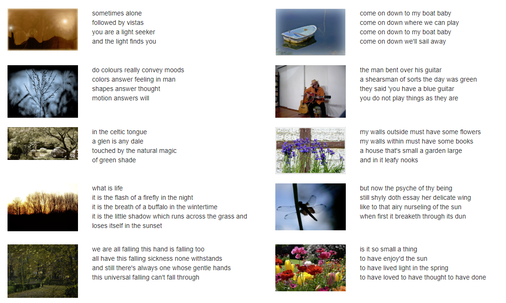
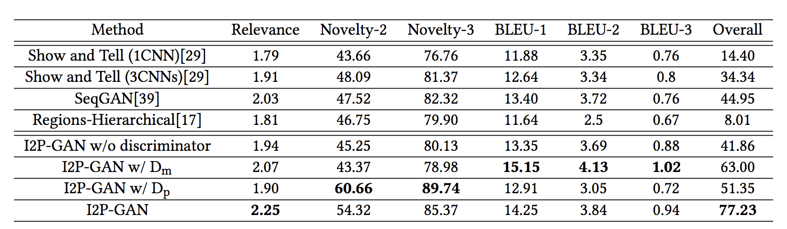
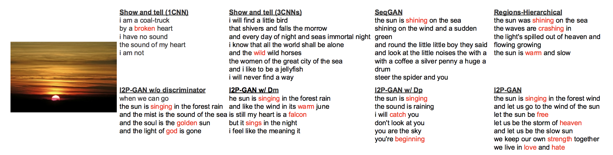

# Beyond Narrative Description: Generating Poetry from Images by Multi-Adversarial Training
An implementation of the image-to-poem model described in the paper:
"Beyond Narrative Description: Generating Poetry from Images by Multi-Adversarial Training."

Bei Liu, Jianlong Fu, Makoto P. Kato, Masatoshi Yoshikawa

Full text available at: https://arxiv.org/abs/1804.08473

## Contents
* [Model Overview](#model-overview)
    * [Introduction](#introduction)
    * [Architecture](#architecture)
* [Getting Started](#getting-started)
    * [Install Required Packages](#install-required-packages)
    * [Prepare the Training Data](#prepare-the-training-data)
    * [Download Trained Model](#download-trained-model)
* [Generating Poems](#generating-poems)
* [Web Demo](#web-demo)

## Model Overview

### Introduction

The Img2poem model is a deep neural network that learns how to generate poems from images. For example:


### Architecture


## Getting Started

### Install Required Packages
(It is recommended to install the dependencies under Conda environment.)  
* python2.7  
* tensorflow1.6  
* mxnet  
* opencv  
* scikit-image  
* tqdm  
* colorama  
* flask

### Prepare the Training Data

| Name | #Poem | #Line/poem | #Word/line |
| :------:| :------: | :------: | :-----: |
| MultiM-Poem | 8,292 | 7.2 | 5.7 |
| UniM-Poem | 93,265 | 5.7 | 6.2 |
| MultiM-Poem(Ex) | 26,161 | 5.4 | 5.9 |

Both datasets are formatted in JSON files.

MultiM-Poem.json: image and poem pairs

```json
[
    {
        "poem": str,
        "image_url": str,
        "id": int
    },
    ...
]
```

UniM-Poem.json: poem corpus

```json
[
    {
        "poem": str,
        "id": int
    },
    ...
]
```



### Download Trained Model
Please download models from https://1drv.ms/u/s!AkLgJBAHL_VFgSyyfpeGyGFZux56 and put it under "code/".

## Generating Poems
The following command line will generate poem for an image.
```bash
python test.py
```
Type in the relative path to the test image in the console and the poem will be generated.
```bash
../images/test.jpg
```

Example output:
```txt
the sun was shining on the sea
shining on the moon
he saw the moon rose
her voice was singing
she sits in beauty gay
red red rose striped eyes
love with a child
love with grace
a little flower
a butterfly love
love a love
to find a flower
every day to be
to find 
```

## Results


Here are some examples of poems generated by eight methods for an image.


## Web Demo
We also prepare a web demo, which is more user friendly. To run such demo, please run
```bash
python server.py
```
under "code/src/" folder. Then you can open http://127.0.0.1:8086 to access the it.
